# RenewCred CMS

A block-based content management system for standards documentation, with an authenticated admin panel and a public site that consumes content entirely through the API.

> **Status:** Step 0 (foundation) complete. Steps 1–9 in progress — see [`PHASE1_BLUEPRINT.md`](PHASE1_BLUEPRINT.md).

---

## Walkthrough

The public site (`apps/web`) built with `next build` and captured from the running
production server. A full narrated video walkthrough and a route-by-route coverage
report are in [`WALKTHROUGH_COVERAGE.md`](WALKTHROUGH_COVERAGE.md).

### Standards index & primary navigation

| Standards index (`/standards`)                              | Hover/focus dropdown menu                                    |
| ----------------------------------------------------------- | ------------------------------------------------------------ |
| 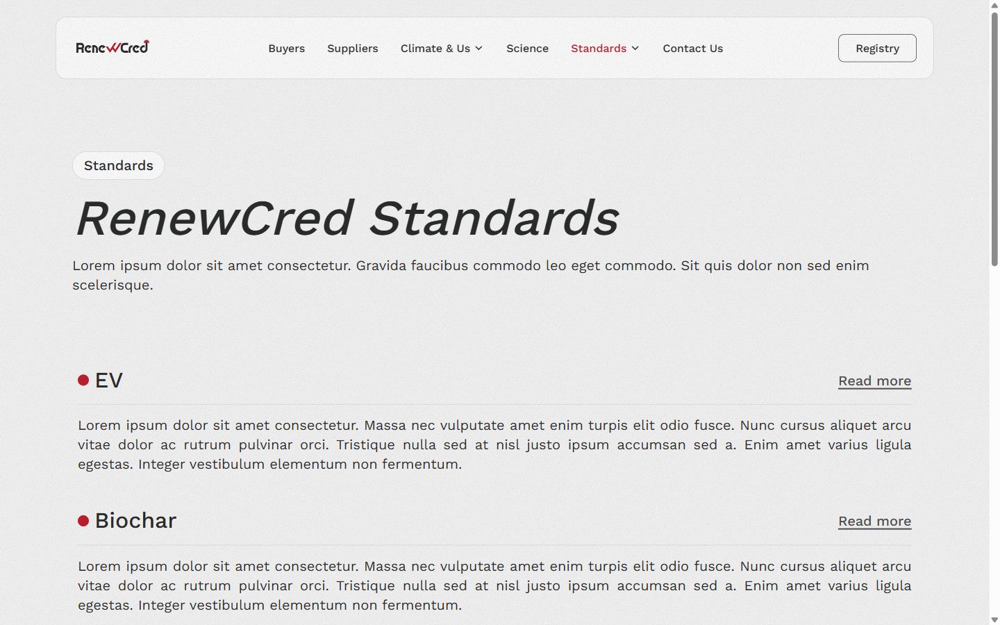 | 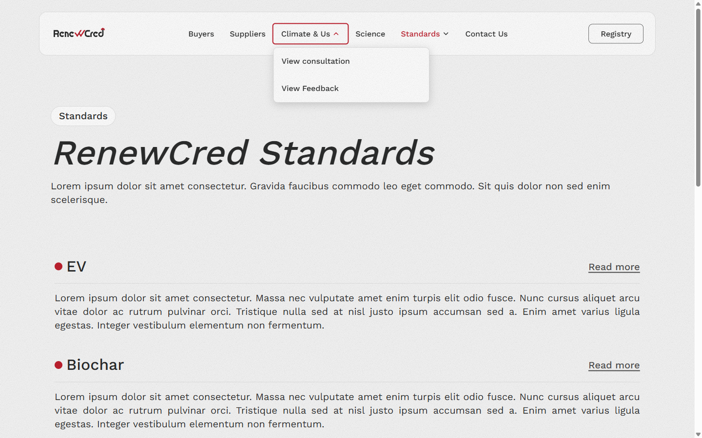 |

### Standard detail — sticky sidebar (search · version · TOC) with math, tables & lists

| Detail — sidebar + document                                    | Document body — equation & nested lists                                |
| -------------------------------------------------------------- | ---------------------------------------------------------------------- |
| 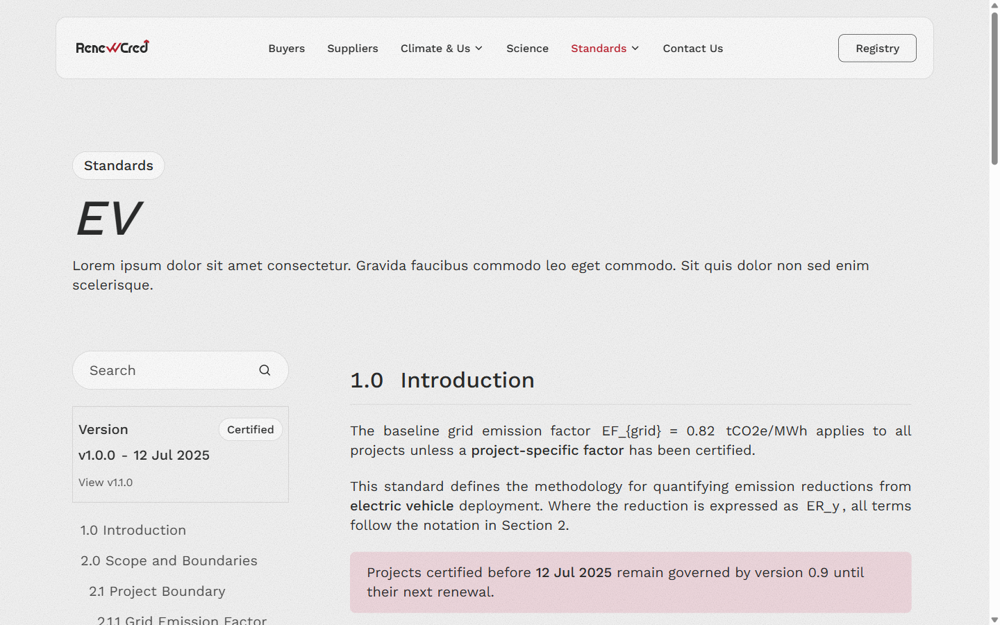 | 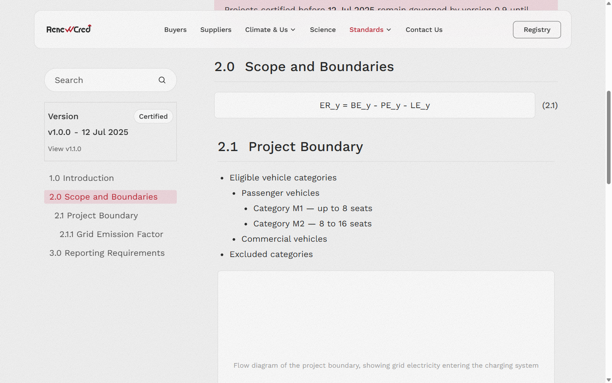 |

### States — empty, coming-soon, 404

| Unpublished standard (empty state)                        | Marketing catch-all                                     | Not found (404)                           |
| --------------------------------------------------------- | ------------------------------------------------------- | ----------------------------------------- |
| 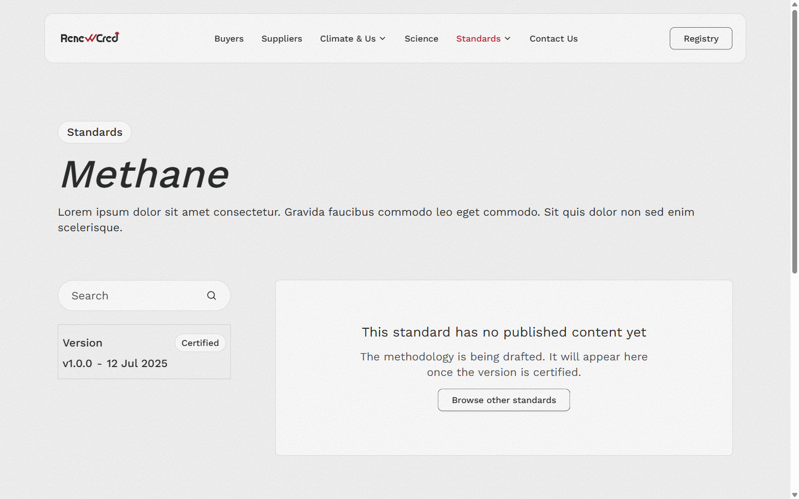 | 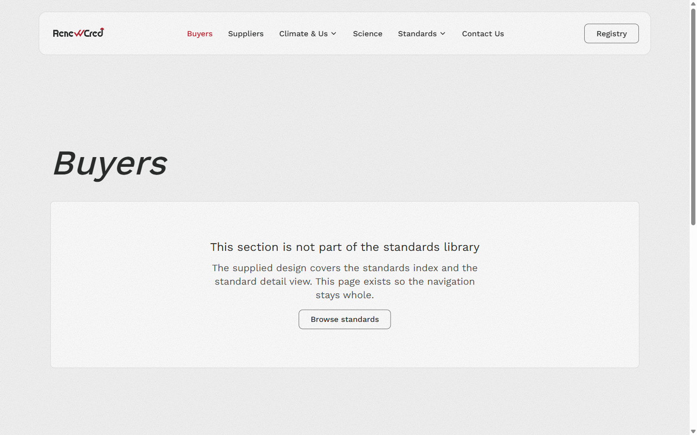 | 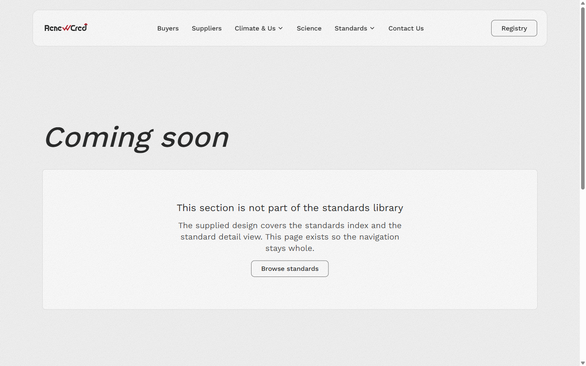 |

### Newsletter — client-side validation → success

| Footer + newsletter form                                            | Success state                                                     |
| ------------------------------------------------------------------- | ----------------------------------------------------------------- |
| 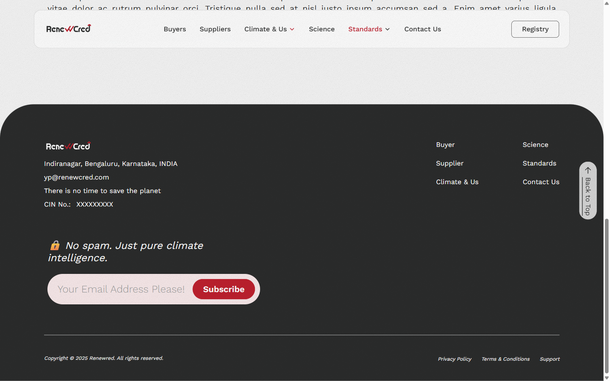 | 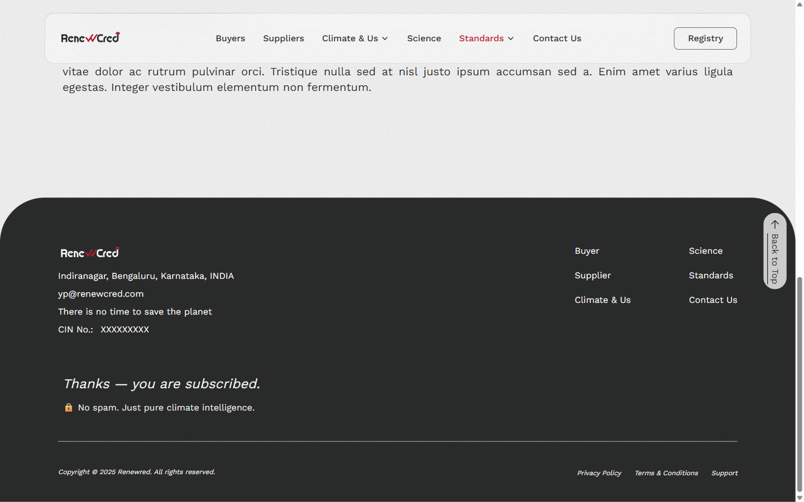 |

### Responsive (mobile 390px)

| Mobile menu (full-width sheet)                      | Mobile index (single column)                          |
| --------------------------------------------------- | ----------------------------------------------------- |
| 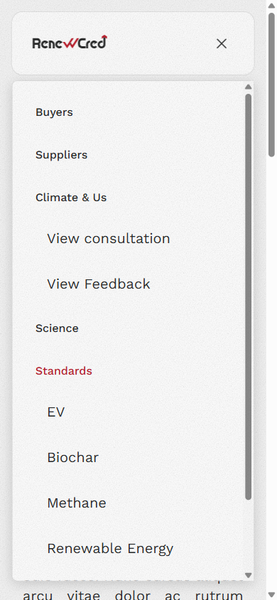 | 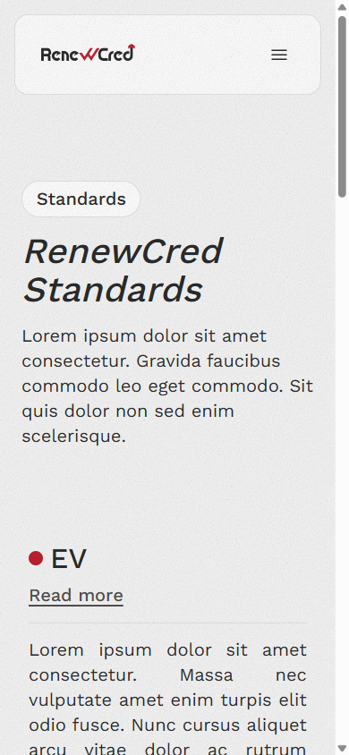 |

---

## Quick start

**Prerequisites:** Node ≥ 20, Docker, [Supabase CLI](https://supabase.com/docs/guides/local-development)

```bash
npm install
cp env.example .env      # then fill in the values it documents
supabase start           # local Postgres + Storage in Docker — no cloud account needed
npm run validate         # typecheck · lint · format · tests
```

`env.example` is the environment template. Every variable it lists is validated at boot — a missing or placeholder value crashes the process rather than falling back to a default.

## Scripts

| Command             | Does                                    |
| ------------------- | --------------------------------------- |
| `npm run validate`  | typecheck → lint → format check → tests |
| `npm run typecheck` | `tsc --build` across all workspaces     |
| `npm run lint`      | ESLint with type-aware rules            |
| `npm run format`    | Prettier write                          |
| `npm test`          | Vitest across all workspaces            |

`npm run validate` is the gate. Git hooks run `lint-staged` pre-commit and `typecheck` pre-push.

## Architecture

```
apps/
  api/       Express — the only database client, owns all business logic
  admin/     Vite + React + Redux Toolkit — auth-gated, no SEO need
  web/       Next.js App Router — public site, SSR/ISR
packages/
  schema/    Zod block schemas — imported by all three, one definition
  tokens/    design tokens → Tailwind preset
  env/       fail-fast environment validation
  logger/    structured logging with enforced redaction
```

**Express is the only database client.** Neither frontend talks to Supabase directly — the brief requires the public site to consume content through the API, and it keeps the `service_role` key in exactly one process.

Content is modelled as a three-level structure: a recursive **section** tree, a flat ordered **block** array per section, and an **inline node** array within text-bearing blocks. That last level is what makes inline math inside a sentence expressible; see [ADR-0003](docs/adr/0003-block-based-content-model.md).

## Documentation

| Document                                                   | Contents                                                     |
| ---------------------------------------------------------- | ------------------------------------------------------------ |
| [`PHASE1_BLUEPRINT.md`](PHASE1_BLUEPRINT.md)               | content inventory, schema, DB model, API contract, roadmap   |
| [`DECISIONS.md`](DECISIONS.md)                             | running engineering decisions log                            |
| [`docs/adr/`](docs/adr/)                                   | architecture decision records                                |
| [`docs/API_CONVENTIONS.md`](docs/API_CONVENTIONS.md)       | response envelope, status codes, request IDs, auth transport |
| [`docs/DATA_WORKFLOW.md`](docs/DATA_WORKFLOW.md)           | migrate/generate/seed commands, RLS policy, seed inventory   |
| [`docs/DEFINITION_OF_DONE.md`](docs/DEFINITION_OF_DONE.md) | completion criteria — the eight states, responsiveness, a11y |
| [`figma/design-tokens.json`](figma/design-tokens.json)     | design tokens extracted from the Figma node tree             |

## Security posture

- The `service_role` key exists only in the Express process. **No browser-facing Supabase key exists at all** — not even a publishable one. The bucket is private; the API issues short-lived signed URLs.
- Refresh tokens are opaque and stored hashed, so logout genuinely revokes and a replayed token is detectable as theft.
- Secrets, tokens, cookies, and connection strings are redacted centrally in `@renewcred/logger` — enforced by config, not by call-site discipline, and covered by tests.
- Every table gets RLS in the migration that creates it, with no permissive policies.

## Design source

Tokens are extracted from the Figma file rather than transcribed by eye. To refresh:

```bash
cp figma/env.figma.example figma/.env.figma.local   # add your token + file key
node figma/pull.mjs
```

`figma/file.json` (4.3 MB) and the frame renders are gitignored and reproducible from that command. The distilled `design-tokens.json` is committed.

## Assumptions

Recorded in [`PHASE1_BLUEPRINT.md` §9](PHASE1_BLUEPRINT.md). The one worth stating up front:

**The Figma contains no tables, equations, or lists** — verified against the node tree. The brief requires all three. So the design governs _visual_ decisions, and the brief governs _content capability_: the schema supports content types the mockup never demonstrates, and the seed data includes them so the capability is visible.

## License

Private — assessment submission.
